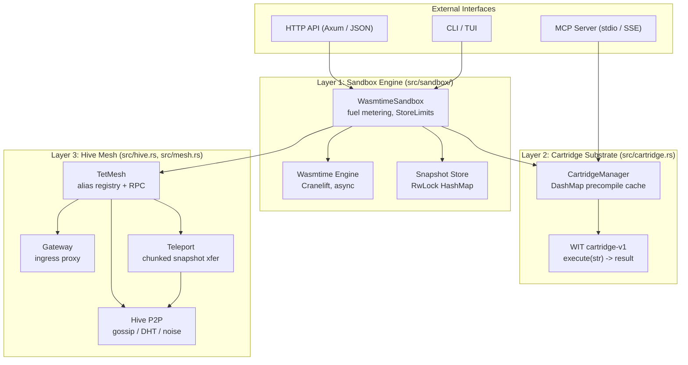
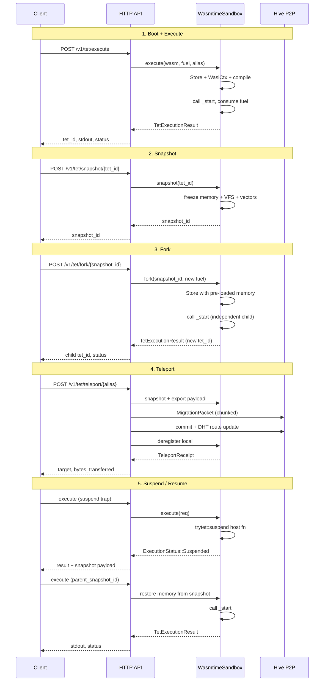

# Trytet Architecture

## System Layers



### 1. Sandbox Engine (`src/sandbox/`)

The execution core uses Wasmtime with fuel metering enabled. Each Wasm instruction consumes fuel from a budget. When fuel or memory limits are exceeded, execution traps deterministically — the engine returns control to the caller with a structured error.

- **Fuel metering**: `consume_fuel()` opcodes injected by Cranelift. Exhaustion produces a `FuelExhausted` trap.
- **Memory limits**: Per-sandbox `StoreLimits` enforce memory caps. OOM produces a `MemoryExceeded` trap.
- **WASI isolation**: Each sandbox gets an isolated `/workspace` directory and optional preopened Oracle cache dir. No host filesystem access.

### 2. Cartridge Substrate (`src/cartridge.rs`, `wit/cartridge.wit`)

Cartridges are Wasm Components implementing the `trytet:component/cartridge-v1` WIT interface:

```wit
interface cartridge-v1 {
    execute: func(input: string) -> result<string, string>;
}
```

The `CartridgeManager` loads, compiles, caches, and invokes cartridges. Each invocation gets its own `Store` with independent fuel and memory budgets. When the Store is dropped, all guest memory is reclaimed.

- **Precompilation cache**: Compiled components are cached by content ID in a `DashMap`. First call compiles (Cranelift AOT, ~400ms); subsequent calls instantiate in <500µs.
- **Fuel isolation**: Each cartridge receives a budget drawn from the caller. Unused fuel is refunded.
- **Error classification**: Traps are classified into `FuelExhausted`, `MemoryExceeded`, `ExecutionError`, `CompilationFailed`, `InterfaceMismatch`, or `RegistryError`.

### 3. Hive P2P Mesh (`src/hive.rs`, `src/mesh.rs`)

An experimental peer-to-peer mesh for agent communication and migration. Nodes discover each other via a gossip protocol and can teleport agents between them.

- **Teleportation**: Serialize an agent's Wasm memory + VFS state into a bincode payload. Transfer over the mesh. Deserialize and resume on the target node.
- **Migration protocol**: Handshake → chunked payload transfer → commit. Uses Noise protocol for transport encryption.

Note: The Hive mesh has not been benchmarked on a multi-node cluster. The teleportation protocol exists in code but should be considered experimental.

### 4. Economy (`src/economy.rs`)

An experimental fuel voucher system for metering computation across nodes. Agents carry Ed25519-signed vouchers that authorize fuel consumption. Nodes verify signatures and track used nonces to prevent replay.

### 5. MCP Server (`src/mcp/`)

Implements the Model Context Protocol over stdio and HTTP. Exposes cartridges as MCP tools. Boots in ~50ms with lazy cartridge compilation.

### 6. Copy-on-Write VFS (`src/memory.rs`)

A tiered vector store backed by HNSW indices for semantic search. Supports `remember` (store) and `recall` (query by vector similarity) operations from within sandboxes.

## Agent Lifecycle



## Module Map

### Core engine

| Path | Purpose |
|---|---|
| `src/engine.rs` | `TetSandbox` trait — abstraction boundary between API and engine |
| `src/sandbox/` | Wasmtime engine, host functions, fuel metering, security |
| `src/cartridge.rs` | Component Model cartridge manager (precompile cache, invoke) |
| `src/models.rs` | Request/response types: `TetExecutionRequest`, `CrashType`, etc. |
| `src/models/manifest.rs` | Agent manifest schema |

### API and server

| Path | Purpose |
|---|---|
| `src/api.rs` | Axum HTTP API router and CORS |
| `src/api/handlers/` | Route handlers: execute, snapshot, fork, teleport, health |
| `src/main.rs` | Binary entrypoint — starts the API server on `:3000` |
| `src/server/` | Server startup, health endpoint, purge thread |
| `src/auth.rs` | API key store and authentication middleware |

### MCP

| Path | Purpose |
|---|---|
| `src/mcp/` | Model Context Protocol server (JSON-RPC over stdio and HTTP) |

### P2P and networking

| Path | Purpose |
|---|---|
| `src/hive.rs` | P2P node discovery, gossip, and teleportation |
| `src/hive/dht.rs` | Distributed hash table for alias resolution |
| `src/mesh.rs` | Inter-agent RPC routing (`TetMesh`) |
| `src/mesh_worker.rs` | Background worker dispatching mesh RPC calls |
| `src/network/` | Noise protocol tunnels and vitality tracking |
| `src/teleport.rs` | Chunked snapshot transfer between nodes |
| `src/gateway.rs` | HTTP ingress proxy for agents |
| `src/market.rs` | Hive market for node pricing and capacity |

### Economy

| Path | Purpose |
|---|---|
| `src/economy.rs` | Fuel vouchers (`FuelVoucher`, `VoucherManager`) |
| `src/economy/bridge.rs` | Host-side economic bridge functions |
| `src/economy/registry.rs` | Economic registry operations |

### Inference and oracle

| Path | Purpose |
|---|---|
| `src/inference.rs` | `NeuralEngine` trait, mock implementation, model registry |
| `src/llama_engine.rs` | Llama.cpp backend for local inference |
| `src/oracle.rs` | HTTP proxy with content-addressed caching and signing |
| `src/model_proxy.rs` | Inference proxy with oracle-backed cache |

### State and memory

| Path | Purpose |
|---|---|
| `src/memory.rs` | Tiered vector VFS with HNSW semantic search |
| `src/shards.rs` | Persistent shard serialization for VFS |
| `src/fork.rs` | Fork primitives for agent branching |
| `src/resurrection.rs` | Agent resurrection from snapshots |
| `src/runtime/` | Runtime recovery and lifecycle |

### Registry

| Path | Purpose |
|---|---|
| `src/registry/` | Local and OCI-compatible cartridge registry |
| `src/registry/oci.rs` | OCI client for remote registries |

### Infrastructure

| Path | Purpose |
|---|---|
| `src/config.rs` | Centralized configuration (`Config::from_env()`) |
| `src/telemetry.rs` | Event broadcast hub for observability |
| `src/crypto.rs` | Ed25519 wallet and key management |
| `src/fortress.rs` | Multi-tenant quota and identity |
| `src/consensus.rs` | Consensus primitives for quorum decisions |
| `src/builder.rs` | Agent build pipeline (BYOL) |
| `src/benchmarks.rs` | Northstar benchmark suite |
| `src/studio.rs` | Embedded developer console |

### WIT interface

| Path | Purpose |
|---|---|
| `wit/cartridge.wit` | WIT interface definition for cartridge components |

## Building

```bash
cargo build --release --bin tet
```

Requires Rust 1.80+. The Wasmtime dependency needs `cmake`, `clang`, and `protobuf-compiler` for the C runtime.
