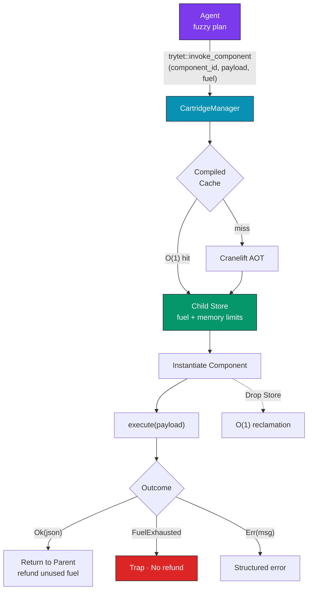

# Trytet Architecture

Trytet is a polyglot monolith for orchestrating, executing, and migrating Wasm-based agents at sub-millisecond latencies.

## System Layers

### 1. The Sandbox (`src/sandbox.rs`, `src/interpreter.rs`)
At the core of Trytet is a highly tuned Wasmtime execution engine. Instead of wrapping an OS layer, it safely compiles WebAssembly modules AOT (Ahead of Time) and provisions memory bounds. 
- **Fuel Determinism**: By injecting `consume_fuel()` opcodes, infinite loops and excessive resource usages are hard-halted before causing node instability.

### 2. Copy-on-Write Vector File System (CoW VFS) (`src/memory.rs`, `src/shards.rs`)
Traditional agents carry bloated state. Trytet's agents are backed by a Tiered Geometric LSM-Vector store. 
When an agent `forks` or is teleported, memory pages and vector storage are instantly deduplicated. Writes target Layer 1 (DashMap) while reads fall through to Layer 2 (Shared RwLock).

### 3. Mesh Router (`src/mesh.rs`, `src/gateway.rs`)
Agents communicate via the Tet Mesh. The gateway translates HTTP ingress to Mesh RPC calls. If an Agent exists on a different machine, the Mesh delegates it to the...

### 4. Hive P2P Substrate (`src/hive.rs`, `src/consensus.rs`)
All Trytet nodes auto-discover sequentially and form the Trytet Hive. 
Migrating an agent from Node A to Node B uses the **Teleportation Protocol** (Phase 14.4).
- **Consensus Lock**: Ensures the agent cannot "fork-bomb" the network by double-execution. 
- Locks use an $O(1)$ multi-phase commit.

### 5. Market Scheduler (`src/market.rs`, `src/economy.rs`)
The cluster is dynamically load-balanced through an **Economic Market Scheduler**:
- Nodes broadcast Market Bids detailing their thermal stress ($T^\circ$) and CPU availability.

### 6. Neuro-Symbolic Cartridge Substrate (`src/cartridge.rs`, `wit/cartridge.wit`)

The Cartridge layer introduces a boundary between stochastic reasoning and deterministic computation. An agent formulates a plan; the Cartridge Substrate executes the formally verifiable portion inside a resource-bounded sub-sandbox.

Cartridges are Wasm Components adhering to the `trytet:component/cartridge-v1` WIT interface. The host function `trytet::invoke_component` bridges the parent agent's linear memory to a child `Store` with independent fuel and memory limits. A Cartridge cannot destabilize its caller.



Key properties:

- **Fuel Isolation**: Each cartridge receives a fixed fuel budget drawn from the parent's balance. Exhaustion produces a `FuelExhausted` trap. No host instability.
- **Memory Boundaries**: Dedicated `StoreLimits` enforce per-cartridge memory caps. The canonical ABI handles string serialization; the host never shares a raw pointer.
- **$O(1)$ Reclamation**: Dropping the child `Store` frees all guest memory in constant time. No GC pause.
- **Pre-Compilation Cache**: `Component::new()` triggers Cranelift. The `CartridgeManager` caches compiled artifacts in a `DashMap` by content ID.
- **Spin-up Overhead**: Cached instantiation targets $< 100\mu s$ (p99 $< 500\mu s$). Bottleneck is `Linker::instantiate`, not compilation.

## Module Map

| File | Purpose | Layer |
|---|---|---|
| `src/main.rs` | Boots the HTTP Server and Engine | Daemon |
| `src/sandbox.rs` | Wasmtime Host Configuration | Compute |
| `src/cartridge.rs` | Component Model Cartridge Manager | Compute |
| `src/market.rs` | Market bidding metrics and arbitrage | Orchestration |
| `src/economy.rs` | Fuel voucher issuance and settlement | Orchestration |
| `src/mesh.rs` | Inter-agent process RPC routing | Network |
| `src/hive.rs` | Multi-node P2P cluster discovery | Network |
| `src/resurrection.rs` | Context-aware Agent artifact reanimation | Lifecycle |
| `src/sandbox/security.rs` | Path Jailer, OOB bounds checking, DoS Watchdogs | Security |
| `src/telemetry.rs` | Nanosecond metrics event stream | Observability |
| `src/benchmarks.rs` | Northstar performance suite | Diagnostics |
| `wit/cartridge.wit` | Cartridge WIT interface definition | Contract |

## Teleportation Flow

1. Node receives `tet teleport agent --node target_id`.
2. Agent's internal execution is paused.
3. Wasm WebAssembly memory buffer gets snapshotted and bincode serialized.
4. CoW VFS vectors are differential-snapshotted.
5. Node A acquires a transit lock over Hive Gossip.
6. Payload is streamed to Node B (`/v1/tet/execute`).
7. Node B deserializes and resumes execution in under $200\mu s$.

## Cartridge Interface Contract

Any Wasm Component exporting this interface can be loaded and executed by an agent at runtime.

```wit
package trytet:component;

interface cartridge-v1 {
    execute: func(input: string) -> result<string, string>;
}

world tool-guest {
    export cartridge-v1;
}
```

Host sends JSON as `input`, receives JSON as output. The guest owns no resources. Fuel, memory, and lifecycle are host-controlled.
