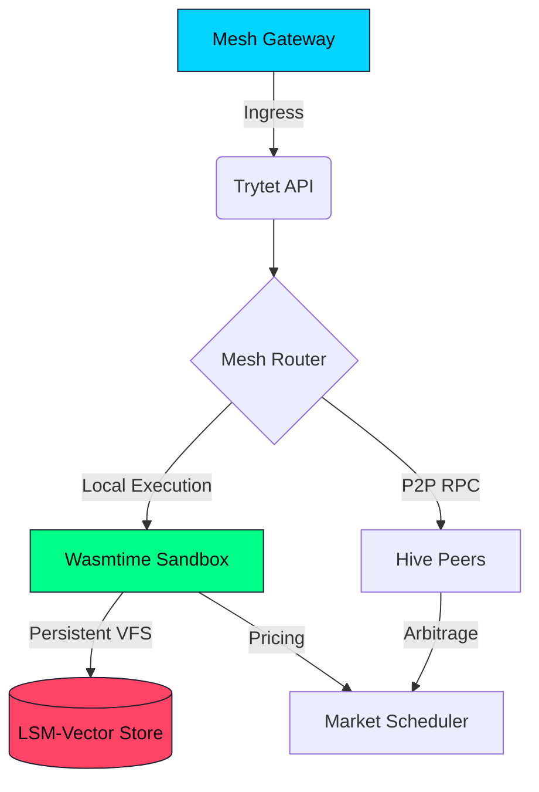

# Trytet Engine

> **The optimally solved agentic sandbox.**

Agents call solvers. Solvers hang. Trytet makes sure the agent doesn't. Deterministic Wasm execution with fuel-bounded traps, live state migration, and $O(1)$ teardown. Rust. Component Model. Sub-200µs cold start.


## Why

| Technology | Cold Start | Solver Safety | Live Migration | Per-Agent Overhead |
|---|---|---|---|---|
| **Docker/K8s** | 2-5s | None | Extremely Difficult | Whole OS Stack |
| **Agent Frameworks** (LangChain, CrewAI) | Variable | None (process-level) | No | Unbounded |
| **V8 Isolates** | 5ms | None | No | High Memory |
| **Trytet** | **< 200µs** | **Fuel-bounded traps** | **Native** | **< 5MB** |

## Architecture

Multi-layer stack. Technical details in the [Architecture Guide](ARCHITECTURE.md).



## Features (v33.1)

- **Neuro-Symbolic Cartridges**: Load deterministic Wasm Components (solvers, verifiers, constraint engines) into an agent's execution graph. Each cartridge runs in a fuel-bounded sub-sandbox with $O(1)$ teardown. The agent reasons; the cartridge computes.
- **Teleportation**: Serialize agent state into a `.tet` artifact, transfer over P2P, revive on a remote node.
- **Copy-on-Write VFS**: Isolated Vector File System with sub-1µs reads and native deduplication on fork.
- **Market Scheduling**: Elastic resource market. Nodes bid for agent workloads using Fuel Vouchers scaled by thermal pressure and CPU availability.
- **Fuel Determinism**: Strict instruction-level fuel limits. Infinite loops are trapped, not timed out.
- **Consensus Locks**: $O(1)$ multi-phase commit prevents double-execution during migration.
- **Northstar Benchmarks**: Built-in latency instrumentation across five critical paths.
- **Path Jailing**: Host filesystem isolation, OOB bounds checking, and preemptive watchdogs for inference loads.

## Quickstart

```bash
# Boot an agent
tet up my-agent.tet --fuel 50000

# View running agents
tet ps

# Tail telemetry
tet logs -f my-agent

# Run the Northstar benchmark suite
tet metrics
```

Dashboard at `http://localhost:3000/console`.

## Documentation

- [Architecture](ARCHITECTURE.md)
- [CLI Reference](CLI.md)
- [Benchmarks](BENCHMARKS.md)
- [API Reference](API.md)
- [Deployment](DEPLOYMENT.md)
