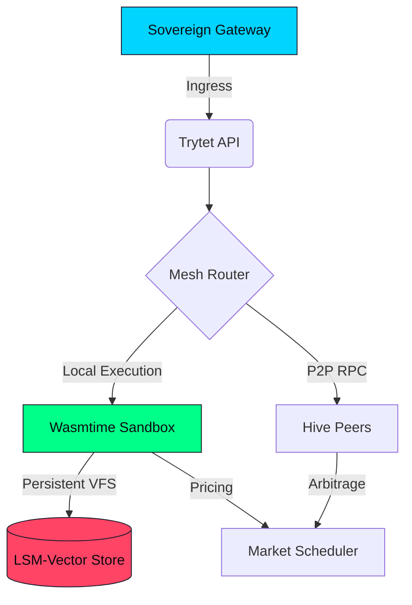

# Trytet Engine

> A 150µs cold-start Wasm engine that teleports AI agents.

Trytet is a deterministic, hyper-ephemeral execution substrate built in Rust. It utilizes WebAssembly to isolate AI agents, snapshot their entire active virtual memory and network state, and instantaneously teleport them across physical nodes or directly into the browser.


## The "Why"

| Technology | Cold Start | Deterministic Execution | Live Migration | Overhead |
|---|---|---|---|---|
| **Docker/K8s** | 2-5 Seconds | No | Extremely Difficult | Whole OS Stack Layer |
| **LLM APIs (Cloud)** | Variable / Latent | No | No | N/A |
| **V8 Isolates** | 5ms | No | No | High Memory Usage |
| **Trytet (Wasmtime)** | **< 200µs** | **Yes (Fuel Mode)** | **Native (Instant)** | **< 5MB per agent** |

## Core Architecture

Trytet is structured into a multi-layer stack. For a deep technical dive, read the [Architecture Guide](ARCHITECTURE.md).



## Features (v27.1)

- **Teleportation**: Serialize agent state into an artifact (`.tet`), transfer it over P2P, and instantly revive it.
- **Copy-on-Write (CoW) VFS**: Agents are natively backed by an isolated Vector File System preventing cross-contamination with sub-1µs memory reads.
- **Market Scheduling**: An elastic resource market that bids for agents using "Fuel Vouchers" based on Node Thermal Pressure and CPU utilization.
- **Wasm-Based Determinism**: Bound loop iterations and infinite workloads via strict "Fuel" limits, effectively guaranteeing node stability.
- **Formally Verified Consensus**: Safely acquire locks over migrating agents.
- **Northstar Benchmarking**: Highly instrumented telemetry proving sub-millisecond execution.

## 5-Minute Quickstart

Get agents communicating locally:

```bash
# Start the Control Plane
tet metrics

# Boot an agent artifact from a file
tet up my-agent.tet --fuel 50000

# View real-time cluster map and state
tet ps

# Tail the agent's telemetry with icons
tet logs -f my-agent
```

Check out the embedded local dashboard directly in your browser: `http://localhost:3000/console`

## Documentation

- 🏛️ [Architecture Deep-Dive](ARCHITECTURE.md)
- 🖥️ [CLI Operator's Reference](CLI.md)
- 🚀 [Northstar Benchmarks](BENCHMARKS.md)
- 🔌 [API Integration Reference](API.md)
- 🌍 [Deployment Guide](DEPLOYMENT.md)
